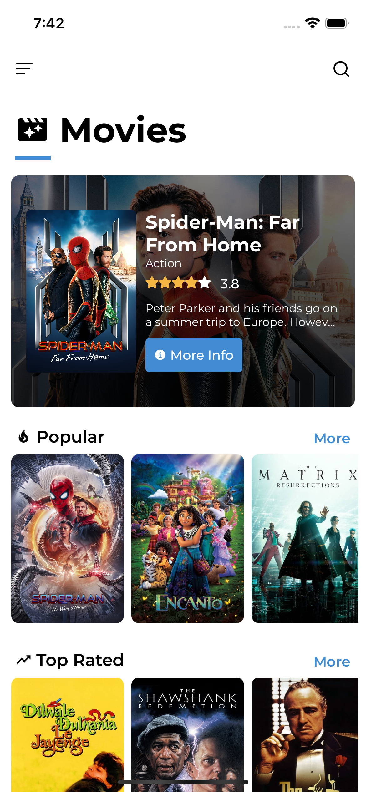
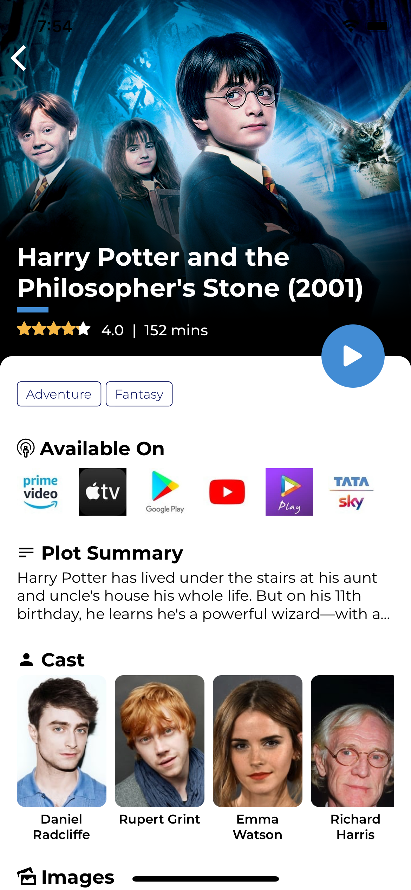
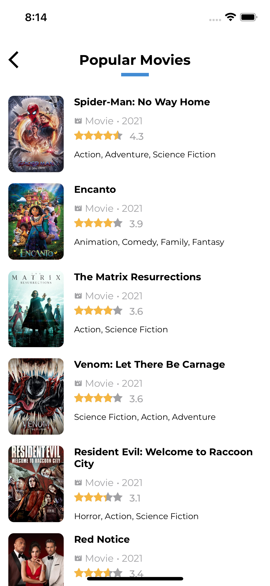
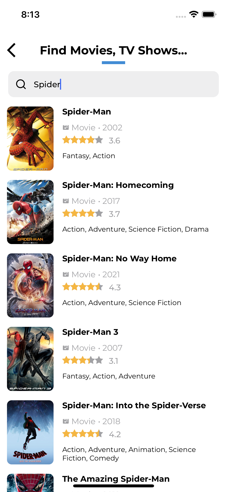

<p align="center">
  <a>
    
  </a>
  <h1 align="center">MovieTime</h1>  
</p>

Millions of movies, TV shows and people to discover. Explore now.
Developed using React Native and TMDB API.

<p align="center">
  
  
</p>

## Screenshot
<p align="center">
  
  
  
  
</p>

## Installation

Install Dependencies

```sh
$ npm install
```

Install Pods (Only for iOS)

```sh
$ cd ios && pod install && cd ..
```
Run Android
```
$ npm run android
```

Run iOS
```
$ npm run ios
```