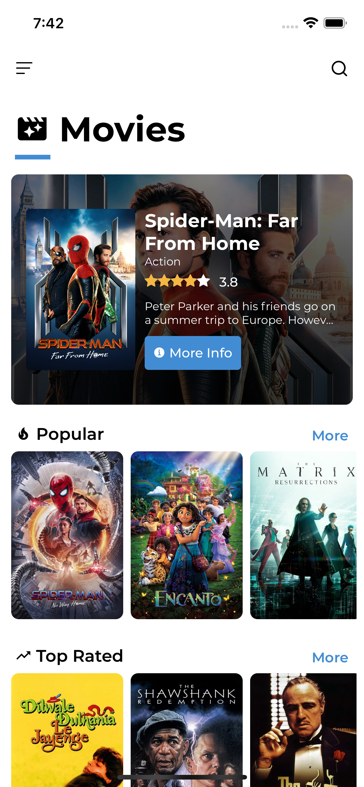
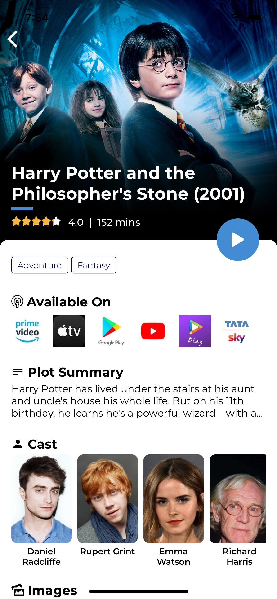
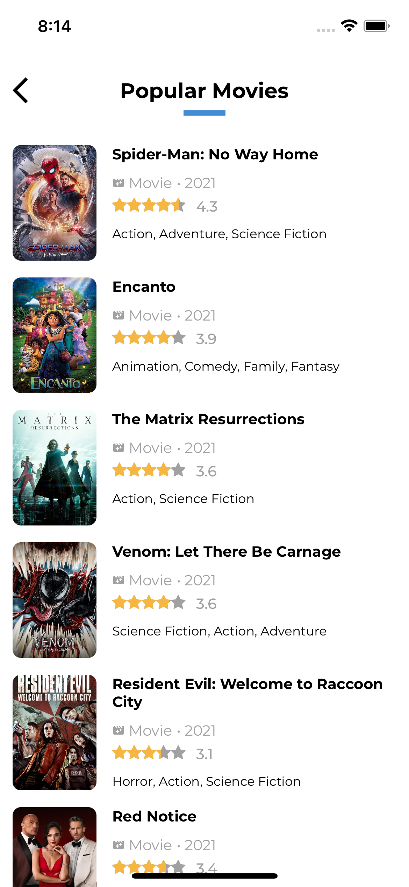
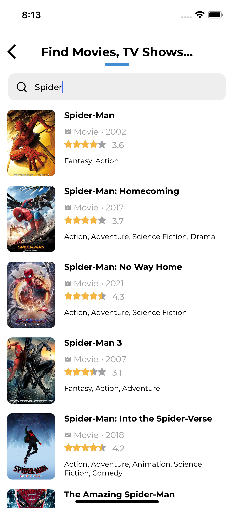

<p align="center">
  <a>
    
  </a>
  <h1 align="center">MovieTime</h1>
</p>

Millions of movies, TV shows and people to discover. Explore now.
Developed using React Native (Expo) and TMDB API.

<p align="center">
  
  
  
</p>

## Screenshot
<p align="center">
  
  
  
  
</p>

## Features

- Home, Movies and TV Shows tabs with carousels and horizontally scrolling lists
- Movie & TV show detail screens (cast, similar titles, ratings)
- Search across movies and TV shows
- Built with [expo-router](https://docs.expo.dev/router/introduction/) (typed routes), TypeScript, [React Query](https://tanstack.com/query) and [FlashList](https://shopify.github.io/flash-list/)

## Installation

Requires Node 18+ and [yarn 4](https://yarnpkg.com/) (`corepack enable`).

Install dependencies:

```sh
$ yarn install
```

Create a `.env` with your TMDB API key (get one at [themoviedb.org](https://www.themoviedb.org/settings/api)):

```sh
$ cp .env.example .env
```

```
EXPO_PUBLIC_TMDB_API_KEY=your_api_key_here
```

Start the dev server:

```sh
$ yarn start
```

Run on a device/simulator:

```sh
$ yarn android
$ yarn ios
```

> `yarn ios` requires macOS with Xcode installed. For a dev build on a physical device, use [Expo Go](https://expo.dev/go) or `npx expo run:device`.

## Scripts

| Command | Description |
| --- | --- |
| `yarn start` | Start the Expo dev server |
| `yarn android` / `yarn ios` | Run a development build on Android / iOS |
| `yarn lint` | Lint with ESLint |
| `yarn typecheck` | Type-check with TypeScript |
| `yarn test` | Run Jest tests |
| `yarn format:write` | Format with Prettier |

## Project structure

```
app/            # File-based routes (expo-router): tabs, movie detail, search
src/
  components/   # Shared UI components
  features/     # Feature modules (home, movie-detail, search)
  lib/          # API config, TMDB services, hooks, theme, constants
  state/        # App state
  types/        # Shared TypeScript types
```

## Acknowledgements

This product uses the TMDB API but is not endorsed or certified by [TMDB](https://www.themoviedb.org/).
